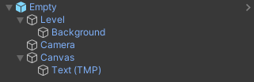
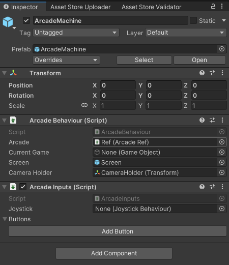
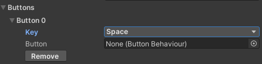
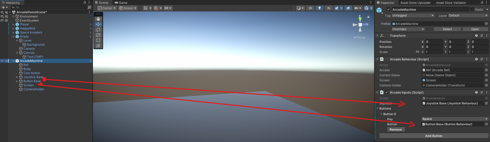
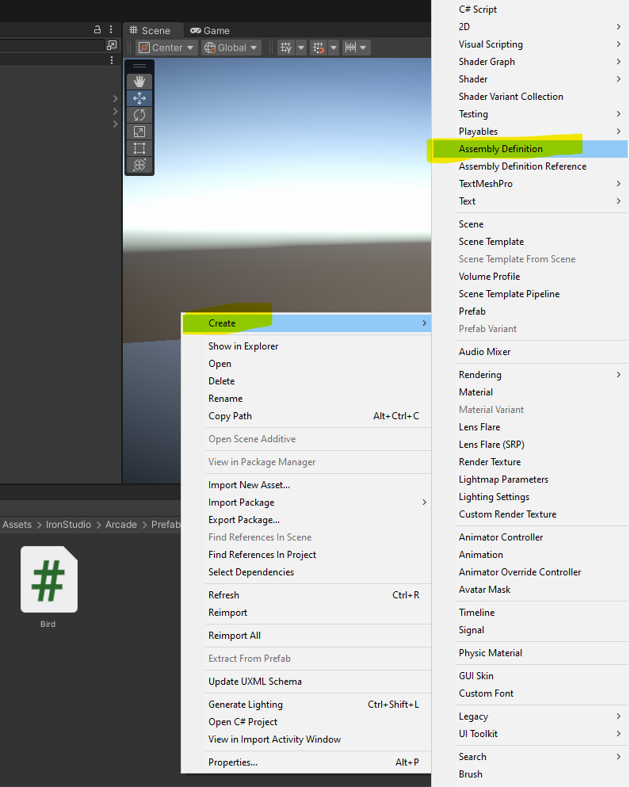
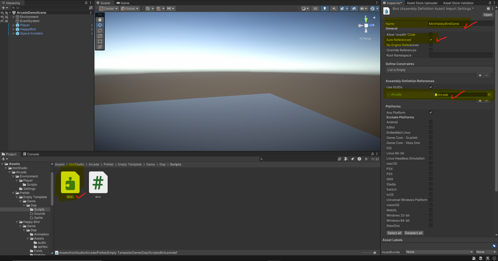
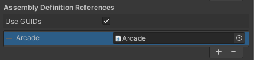

# Create First Game

After creating your arcade machine, you can now create your first mini-game.

First, create a new folder for your game inside your project.  
Then copy the **Game Template** from the arcade system folder and place it in your scene.

Make sure the template contains the **MiniGameManager** component.  
This component is responsible for communication between the arcade machine and the mini-game.

Finally, assign your game prefab inside the **ArcadeBehaviour** component of the arcade machine.

---

## Example: Happy Bird

In this example we will create a simple mini-game called **Happy Bird**.

Below is the basic structure of the empty game template.



---

## Creating the Bird

Inside the template:

1. Create a **2D Sprite** called **Bird**
2. Create a new C# script called **BirdMovement**
3. Attach the script to the Bird object

Example script:

```csharp
public class BirdMovement : MonoBehaviour
{
    public MiniGameManager gameManager;
    private ArcadeInputs inputSystem;

    void Start()
    {
        inputSystem = gameManager.GetArcadeInput();
    }

    void Update()
    {
        if (inputSystem.GetKeyDown(KeyCode.Space))
        {
            Jump();
        }
    }

    void Jump()
    {
        // Add bird jump logic here
    }
}
```

Drag the **MiniGameManager** from the template prefab into the `gameManager` field in the inspector.

The script retrieves the arcade input system using:

`gameManager.GetArcadeInput()`

This allows your mini-game to use the arcade machine buttons instead of the player's normal controls.

---

## Adding Inputs

Before the script can detect button presses, you must configure the arcade inputs.

1. Select the **Arcade Machine**
2. Find the **ArcadeInput** component in the inspector
3. Click **Add Button**



Choose the **KeyCode** (for example `Space`).



Then drag the **ButtonBase** and **JoystickBase** children objects to the ArcadeInput component.



You can add as many buttons as you need for your game.

---

## Restarting the Game

To restart the game when the player dies:

```csharp
void Dead()
{
    gameManager.Restart();
}
```

---

## Starting the Arcade

To start playing:

1. Move the player near the arcade machine
2. Face the arcade cabinet
3. Press **E**

The system will automatically switch input and start the mini-game.

---

## Assembly Definition (Important)

To avoid script conflicts with other assets, it is recommended to create an **Assembly Definition** for your mini-game.

Create a new Assembly Definition in your game folder.



Give it a unique name.



Then add a reference to the **Arcade** assembly.



This ensures your scripts can access the arcade system correctly.